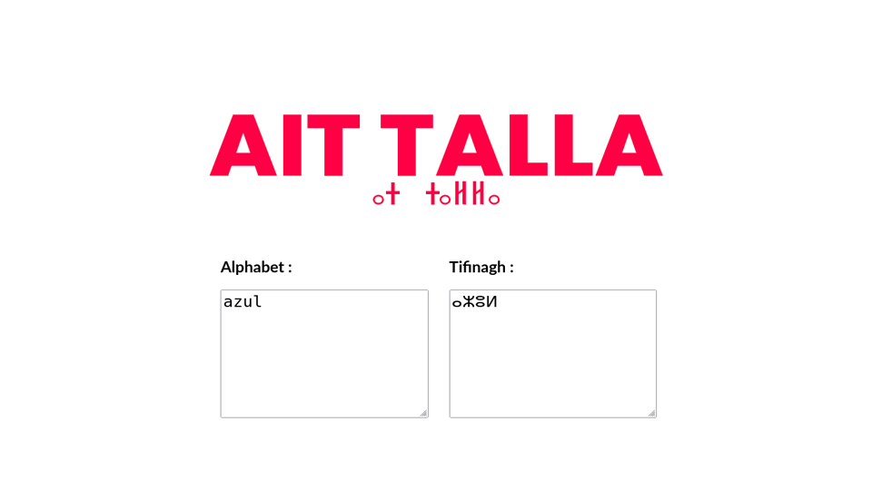

# Translittération Alphabetique vers Tifinagh

Bienvenue dans le dépôt GitHub de **Translittération Alphabetique vers Tifinagh** ! Ce projet fournit un outil simple pour convertir des lettres de l'alphabet latin en lettres Tifinagh, permettant ainsi une translittération facile pour les textes en langue Tifinagh.

## Table des matières

- [Présentation](#présentation)
- [Fonctionnalités](#fonctionnalités)
- [Installation](#installation)
- [Utilisation](#utilisation)
- [Contribuer](#contribuer)
- [Licence](#licence)

## Présentation

Cet outil est conçu pour aider à la translittération des caractères de l'alphabet latin en caractères Tifinagh, une écriture utilisée pour les langues berbères. Il facilite la conversion des textes latins en Tifinagh pour des applications linguistiques, éducatives et culturelles.

## Fonctionnalités

- **Translittération Automatique** : Convertit les lettres de l'alphabet latin en équivalents Tifinagh.
- **Personnalisable** : Ajoutez ou modifiez les mappings de translittération selon vos besoins.
- **Facile à Utiliser** : Interface simple pour les utilisateurs, avec des exemples intégrés.


## Installation

Pour utiliser cet outil, vous devez cloner le dépôt et installer les dépendances nécessaires. Voici les étapes pour l'installation :

1. **Cloner le dépôt :**

    ```bash
    git clone https://github.com/aitTalla/Tifinagh-Translitteration-alphabetique.git
    cd Tifinagh-Translitteration-alphabetique
    ```

2. **Ouvrer La page index.html :**

    Assurez-vous d'avoir un navigateur internet (je sais que vous avez un si non vous pouvez pas lire cette page 🥸)
    Ouver Juste Le fichier index.html avec un navigateur (c'est tres Simples)

## Utilisation

Une fois dans la page, vous pouvez utiliser l'outil en tappent dans les champ 😍.


### Utilisation dans un projet JavaScript

```javascript

function translateAlphabetToTifinagh(texte) {
  // list de caractère alphabetiques
  let lettresAlphabetiques = ['a', 'b', 'c', 'd', 'e', 'f', 'g', 'h', 'i', 'j', 'k', 'l', 'm', 'n', 'o', 'p', 'q', 'r', 's', 't', 'u', 'v', 'w', 'x', 'y', 'z','D','H',"A",'R',"S","T","Z","U"];
  // list de caractère tifinagh
  let tifinagh_Letter = ["ⴰ","ⴱ","ⵛ","ⴷ","ⴻ","ⴼ","ⴳ","ⵀ","ⵉ","ⵊ","ⴽ","ⵍ","ⵎ","ⵏ","ⴵ","ⵒ","ⵇ","ⵔ","ⵙ","ⵜ","ⵓ","ⵠ","ⵡ","ⵅ","ⴴ","ⵣ","ⴹ","ⵃ",'ⵄ',"ⵕ","ⵚ","ⵟ","ⵥ","ⵂ"];

  let texteModifie = '';

    // Parcourir chaque caractère dans le texte
    for (let i = 0; i < texte.length; i++) {
        let caractere = texte[i];
        
        // Vérifier si le caractère est dans le tableau des lettres à changer
        if (lettresAlphabetiques.includes(caractere)) {
            // Trouver l'index dans le tableau des lettres à changer
            let index = lettresAlphabetiques.indexOf(caractere);
            
            // Remplacer par la lettre correspondante dans le tableau des lettres en ordre alphabétique
            texteModifie += tifinagh_Letter[index];
        } else {
            // Conserver le caractère d'origine s'il ne doit pas être remplacé
            texteModifie += caractere;
        }
    }
    return texteModifie;
}
```

<a target="_blank" href="https://aittalla-corporation.web.app/"></a>
